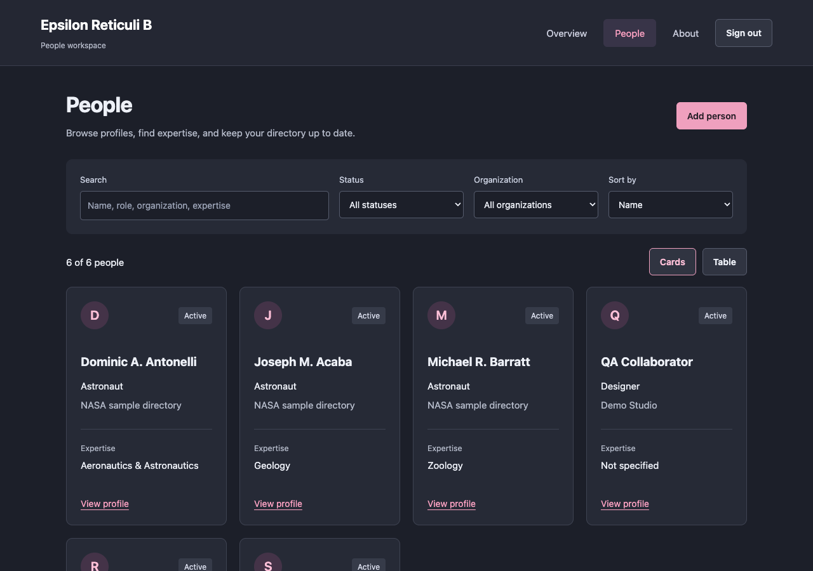
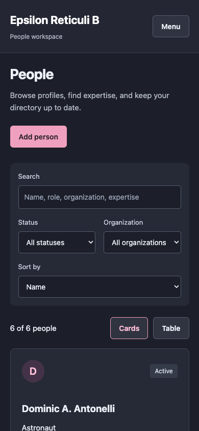

> **Consolidated application:** Epsilon’s profile and form workflow is now part of [Event Horizon — People Workspace](https://github.com/TheArchitect71/Event-Horizon). Run that application for persistent create/read/update/delete, routed profiles, functional search/filtering, and cohesive navigation. This archived repository preserves the original standalone experiment and its history. Active development continues in Event Horizon.

# Epsilon Reticuli B — Astronaut Directory

An astronaut directory UI experiment with a sidebar, selection chips, portrait cards, and an add-astronaut dialog. It uses 50 bundled records in an Angular/Material frontend.

## What you can do

- Browse astronaut profiles and education details.
- Select and clear sidebar filter chips.
- Open the account menu and try the validated add-astronaut form.

## Preview



Captured from the running application on September 30, 2026. Any sample records shown are demonstration or isolated test data, not data included with a fresh installation.

<details>
<summary>Mobile view</summary>



</details>

## Run locally

Use the Node version in `.nvmrc` (currently 26.10.0) and npm. Run these commands from the repository root.

```sh
nvm use  # if you manage Node with nvm
npm ci
npm start
```

Open [http://127.0.0.1:4200](http://127.0.0.1:4200). Keep the server in the foreground; stop it with **Ctrl+C**.

## Current scope

Filter chips show your selection but do not filter the cards; search and logout are placeholders. Saving the form logs its values and closes it without adding or persisting an astronaut. Portraits use the original NASA/Wikimedia URLs, with a bundled fallback when unavailable; the screenshot shows the offline fallback.

## Development

```sh
npm run build
npm run typecheck
npm test -- --browsers=ChromeHeadless
```

Browser tests require Chrome or Chromium; set `CHROME_BIN` if it is outside the standard installation path. Angular 22 currently requires TypeScript 6.0.x. The Jasmine 6 test dependencies are retained for compatibility with Zone.js.
